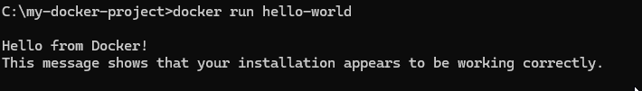
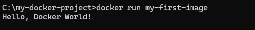

# my-first-devops

## Описание тестового задания 

Выполнение этих тестовых заданий продемонстрирует мои навыки работы с Git, GitHub и Docker.

## Выполненные шаги

### Часть 0: Установка программ и настройка окружения

1. Создание виртуальной машины:
Я создаю виртуальную машину с серверной версией Ubuntu в программе VMware Workstation Pro:

\# Лабораторная работа: Docker

\## Результаты выполнения

\### 1. Запуск тестового контейнера hello-world

!\[Запуск hello-world контейнера](screenshots/hello-world.png)

\*Рисунок 1 - Успешный запуск контейнера hello-world с сообщением "Hello from Docker!"\*

\### 2. Запуск собственного Docker-контейнера

!\[Запуск my-first-image контейнера](screenshots/my-first-image.png)

\*Рисунок 2 - Выполнение Python-скрипта внутри Docker-контейнера с выводом "Hello, DevOps World!"\*

\## Файлы проекта

\- `Dockerfile` - инструкция для сборки образа

\- `script.py` - Python-скрипт с выводом сообщения

git add README.md
git commit -m "Fix image paths in README"
git push

# Docker Lab Results

## Скриншоты

### Hello World Container

### Custom Container

