# my-first-devops

## Описание тестового задания 

Выполнение этих тестовых заданий продемонстрирует мои навыки работы с Git, GitHub и Docker.

## Выполненные шаги

### Часть 0: Установка программ и настройка окружения

1. Создание виртуальной машины:

Я создаю виртуальную машину с серверной версией Ubuntu в программе VMware Workstation Pro:
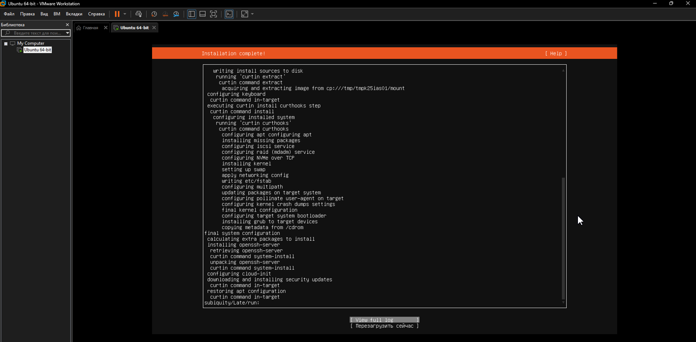

Вход в виртуальную машину:
 
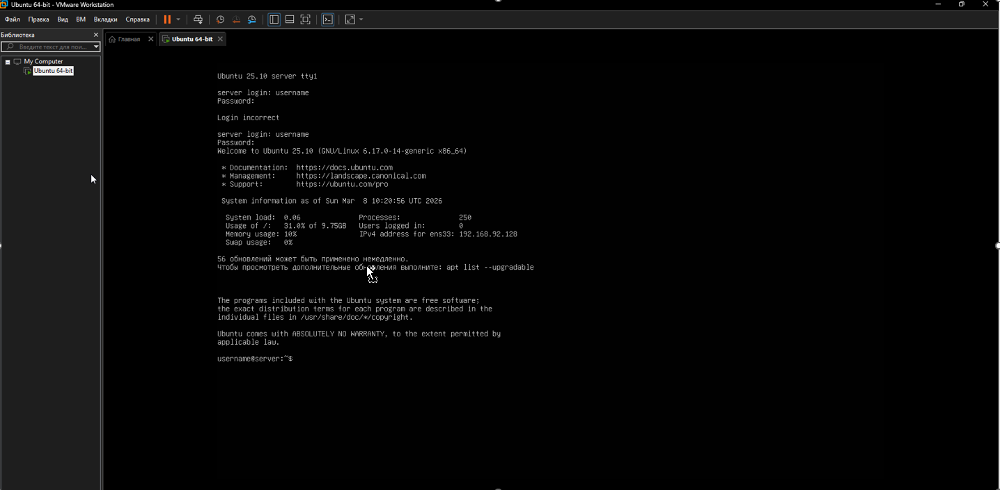

2.Подключение к серверу: 

Подключению к серверу по SSH из MobaXterm, terminal:

MobaXterm:

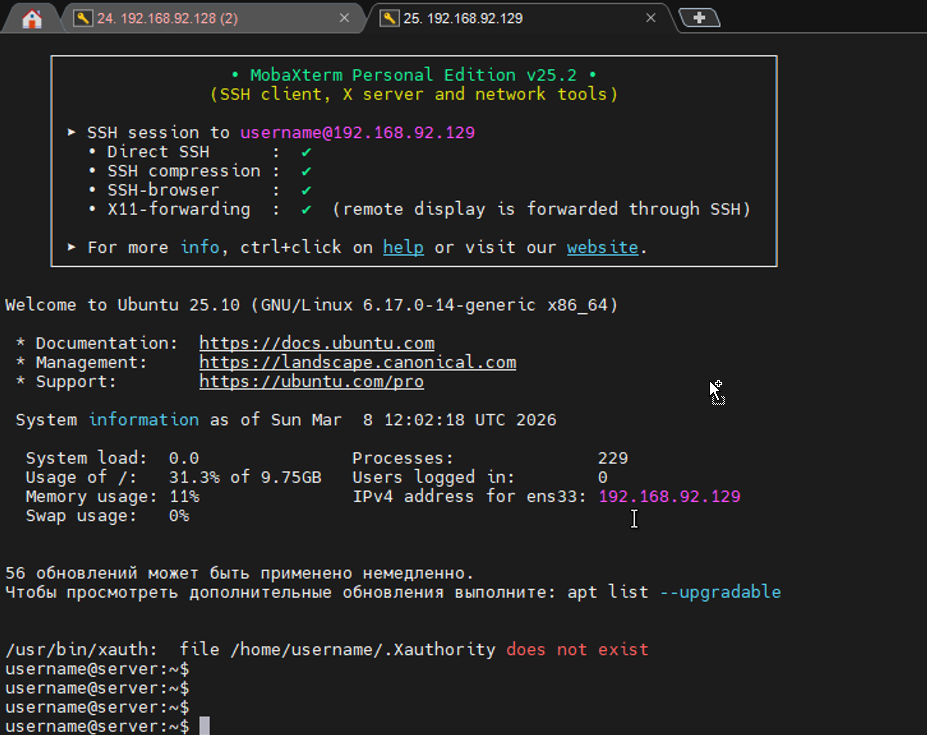

Terminal:

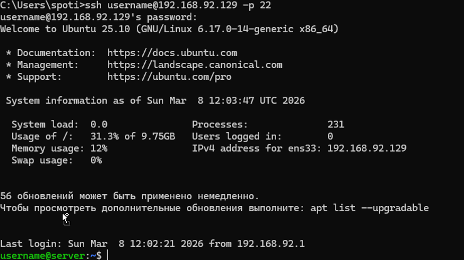

### Часть 1: Установка программ и настройка окружения

1.Установка Git:

Скачиваем установщик из официального сайта Git. Запускаем установку и следуем инструкциям установщика.

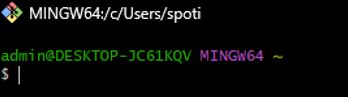

Проверяем работает ли программа корректно:

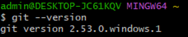

2.Создание аккаунта на GitHub:

Регистрация аккаунта:

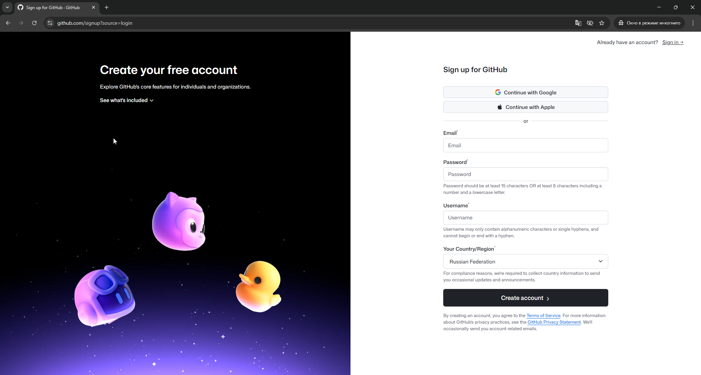

Аккаунт создан:

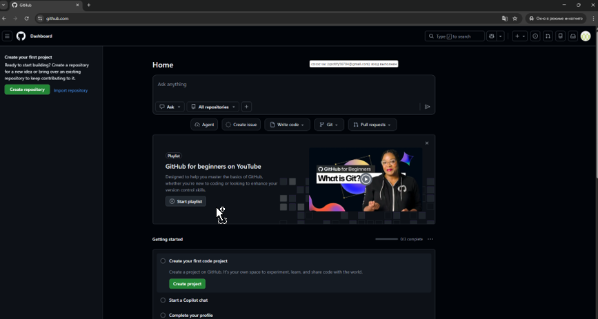

Создание SSH-ключа и добавление его на аккаунт:

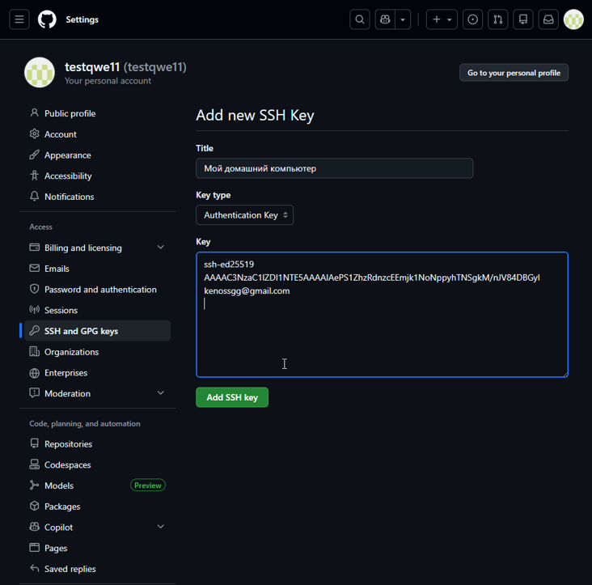

Проверка корректности настройки GitHub-key:

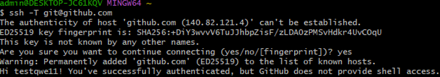

### Часть 2: Работа с GitHub

1.Создание репозитория:

Создаю на GitHub публичный репозиторий с названием my-first-devops:

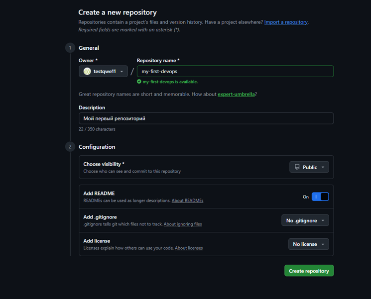

Внутри репозитория создал файл README.md:

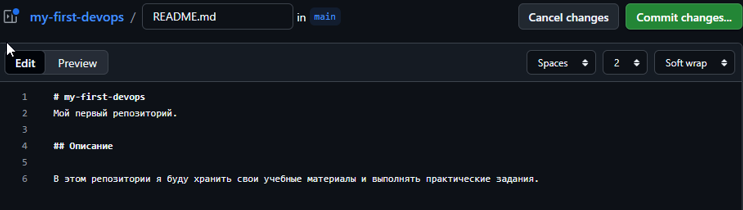

2.Наполнение репозитория:

3.Клонирование репозитория.

Склонировал созданный репозиторий на локальный компьютер: 

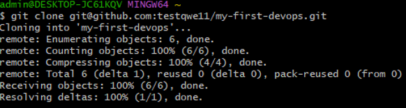

Переход в директорию репозитория:

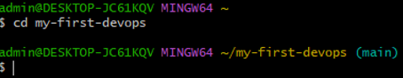

Просмотр его содержания:

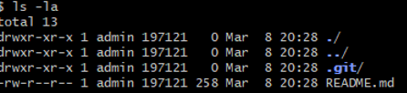

### Часть 3: Установка и работа с Docker

1.Установка Docker на свой компьютер, следуя официальной инструкции на официальном сайте Docker. После установки убеждаюсь, что Docker работает корректно:

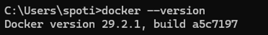

2.Запускаю Docker-контейнер с образом hello-world:

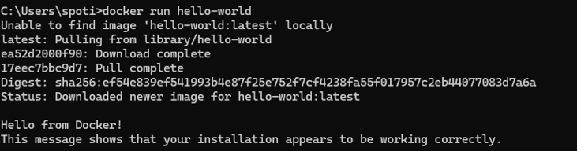

\# Лабораторная работа: Docker

\## Результаты выполнения

\### 1. Запуск тестового контейнера hello-world

!\[Запуск hello-world контейнера](screenshots/hello-world.png)

\*Рисунок 1 - Успешный запуск контейнера hello-world с сообщением "Hello from Docker!"\*

\### 2. Запуск собственного Docker-контейнера

!\[Запуск my-first-image контейнера](screenshots/my-first-image.png)

\*Рисунок 2 - Выполнение Python-скрипта внутри Docker-контейнера с выводом "Hello, DevOps World!"\*

\## Файлы проекта

\- `Dockerfile` - инструкция для сборки образа

\- `script.py` - Python-скрипт с выводом сообщения

git add README.md
git commit -m "Fix image paths in README"
git push

# Docker Lab Results

## Скриншоты

### Hello World Container

### Custom Container

